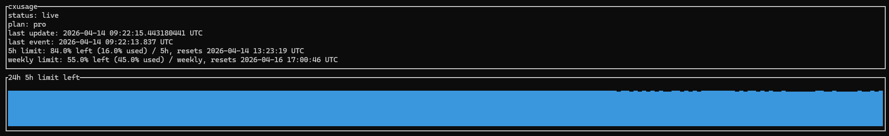

# cxusage

`cxusage` は、Codex の usage をターミナルで常時確認するためのローカル TUI ツールです。

Codex のセッションログ `~/.codex/sessions/**/*.jsonl` をポーリングし、`token_count` / `rate_limits` イベントから 5h limit と weekly limit の残量を表示します。Codex のインタラクティブな `/status` 画面をスクレイピングするのではなく、ローカルに保存されたイベントを読み取ります。



## ステータス

これは初期 v1 実装です。

- ローカルマシン専用
- 単一ユーザー向け
- poll ベース
- 5h limit / weekly limit の残量表示
- チーム集約、通知、Prometheus export は未対応

## インストール

Homebrew でインストールできます。

```sh
brew tap HayattiQ/tools
brew install cxusage
```

tap せずに直接インストールする場合:

```sh
brew install HayattiQ/tools/cxusage
```

現在の Homebrew formula は source build 方式です。インストール時に Homebrew の `rust` build dependency を使ってビルドします。インストール後に実行される `cxusage` 自体は Rust の単独バイナリです。

ソースから直接入れる場合:

```sh
cargo install --path .
```

## 使い方

まず、Codex のローカルイベントを読めるか確認します。

```sh
cxusage doctor
```

ライブ監視を開始します。

```sh
cxusage watch
```

`watch` は `q` または `Esc` で終了します。

パスやポーリング間隔を指定する場合:

```sh
cxusage --codex-dir ~/.codex --data-dir ~/.local/share/cxusage --interval 30s watch
```

## 表示内容

`watch` では主に次の値を表示します。

- `5h limit`: 5 時間ウィンドウの残量
- `weekly limit`: 週次ウィンドウの残量
- `last event`: 最後に観測した Codex usage event の時刻
- `plan`: Codex plan type
- `context window`: model context window
- 直近 24 時間の 5h limit 残量トレンド

例:

```text
5h limit: 92.0% left (8.0% used) / 5h, resets ...
weekly limit: 44.0% left (56.0% used) / weekly, resets ...
```

## 読み取るデータ

`cxusage` は次の Codex セッション JSONL を読みます。

```text
~/.codex/sessions/**/*.jsonl
```

`token_count` イベントから次の値を正規化します。

- 5h limit の使用率、残量、リセット時刻
- weekly limit の使用率、残量、リセット時刻
- plan type
- model context window
- event timestamp

`cxusage` 自体の履歴と checkpoint は app data directory に保存します。既定では OS / Homebrew 環境のデータディレクトリ配下の `cxusage` ディレクトリを使います。

## コマンド

```text
cxusage watch
cxusage doctor
```

共通フラグ:

```text
--codex-dir <path>    Codex の config/data directory。既定は ~/.codex
--data-dir <path>     cxusage の app data directory
--interval <duration> poll 間隔。既定は 30s
```

duration は `s`, `m`, `h` suffix に対応しています。

## 開発

```sh
cargo test
cargo fmt --check
cargo clippy --all-targets --all-features -- -D warnings
```

## Homebrew tap

Homebrew tap は次のリポジトリで管理しています。

```text
https://github.com/HayattiQ/homebrew-tools
```

formula は tap 側では `Formula/cxusage.rb`、このリポジトリ内のテンプレートは `packaging/homebrew/cxusage.rb` にあります。
